# Introdução

Informações básicas do projeto.

* **Projeto:** Dona Cocina
* **Repositório GitHub:** [Dona Cocina](https://github.com/ICEI-PUC-Minas-PPLCC-TI/ti-1-ppl-cc-m-20232-dona-cocina-restaurante.git)
* **Membros da equipe:**

  * [Davi Santana](https://github.com/davisantana07) ✳️
  * [Maria Eduarda](https://github.com/maria-botelho) ✳️
  * [João Miranda](https://github.com/JoaoMiranda1921) ✳️
  * [Hamilton Henrique](https://github.com/Hhg11) ✳️
  * [Octavio Vieira](https://github.com/tavinzm) ✳️
  * [Breno de Oliveira](https://github.com/bhass3l) ✳️

A documentação do projeto é estruturada da seguinte forma:

1. Introdução
2. Contexto
3. Product Discovery
4. Product Design
5. Metodologia
6. Solução
7. Referências Bibliográficas

✅ [Documentação de Design Thinking (MIRO)](files/processo-dt.pdf)

# Contexto

Detalhes sobre o espaço de problema, os objetivos do projeto, sua justificativa e público-alvo.

## Problema

**✳️✳️✳️ COLOQUE AQUI O SEU TEXTO ✳️✳️✳️**
>
> O problema escolhido por nós para ser sanado por essa aplicação web é que, com bastante frequência, as pessoas não conseguem ou tem dificuldade em obter informações do horários de funcionamento do restaurante, o seu cardápio e a disponibilidade de mesas para ser feito a sua reserva, de uma maneira rápida e eficiente, o que pode resultar em frustração e desistência por parte dos mesmos, ocasionando a perda de uma oportunidade de renda e potenciais clientes. Com o avanço da internet e seu uso cada vez mais presente no dia a dia, os restaurantes vêm enfrentando esse desafio de organizar essas funcionalidades de forma integrada a web e de proporcionar uma experiência fluida e com o mínimo de erros possíveis. Utilizando esta aplicação, esse problema seria facilmente solucionado pela mesma, agregando valor a vida dos clientes e os administradores dos restaurantes.
>


## Objetivos

**✳️✳️✳️ COLOQUE AQUI O SEU TEXTO ✳️✳️✳️**

>
> Atender o público-alvo que busca realizar suas reservas no restaurante de forma prática e intuitiva, garantindo uma experiência agradável e transparente. Fazendo assim, com que  o usuário se mantenha informado do que é fornecido no site, não apenas mostrando o produto oferecido, mas sim sobre as informações gerais contidas no mesmo.

Objetivos específicos: deixar as páginas intuitivas e responsivas para melhor proveito e navegação no site, criar uma aba para realizar login/ cadastro no site, e também, uma seção para dúvidas frequentes ou informações para contato com o restaurante.
>
>

## Justificativa

**✳️✳️✳️ COLOQUE AQUI O SEU TEXTO ✳️✳️✳️**

>A oferta de reservas online por meio de um programa web é interessante pois evita a exclusão de clientes que não podem e também os que não gostam de reservar por telefone, como aqueles com problemas de audição ou pessoas que tentam reservar fora do horário de funcionamento, abrangendo o atendimento a diversos tipos de cliente. Reservas online tornaram-se populares devido à sua conveniência, aumentando a probabilidade de atrair mais clientes através deste método.Por meio dele, os clientes podem controlar o processo de reserva, escolhendo data, hora, tamanho do grupo e até a área do restaurante, de acordo com a sua necessidade. Além desses já descritos, há vários outros benefícios de implementá-lo em seu negócio, assim como é apresentado numa matéria escrita pela Tablein.
> 

## Público-Alvo

**✳️✳️✳️ COLOQUE AQUI O SEU TEXTO ✳️✳️✳️**

>
> O público alvo do restaurante são indivíduos que sentem falta da comida caseira e de um ambiente acolhedor propicio para dar uma pausa na correria do dia-a-dia. Visamos o conforto, o acolhimento e a troca de experiência, visto que possuímos um público variado, com idades distintas - desde os mais jovens, que estão no início da vida adulta a idosos, que buscam relembrar o aconchego de suas origens por intermédio do paladar.  Em maioria, as reservas do nosso restaurante são compostas por advogados e empreendedores, que trazem seus clientes e futuros clientes para fins de negociação. Existem também as reservas para aniversários e semelhantes, realizadas principalmente pelo público mais jovem. Aos finais de semana boa parte da nossas reservas são feitas por anfitriões da família, que trazem suas gerações para contemplar o espaço e a comida boa. A localização do restaurante é em Belo Horizonte, na área centro-sul, entretanto nosso público vem majoritariamente da região metropolitana, como Nova Lima, Lagoa Santa, Pedro Leopoldo, entre outros. Também temos os turistas que buscam experimentar nossos pratos e se deliciar com nossas sobremesas.Aguardamos nossos clientes com um ambiente amplo, bem estruturado e organizado, propicio para atender nossa freguesia com simpatia e profissionalismo, com um atendimento único e especializado.

# Product Discovery

## Etapa de Entendimento

**✳️✳️✳️ APRESENTE OS ARTEFATOS DA ETAPA  ✳️✳️✳️**

> * **Matriz CSD**: também conhecida por Matriz de Alinhamento, é uma ferramenta utilizada no Design Thinking para organizar informações e facilitar o processo de tomada de decisão e solução de problemas;

[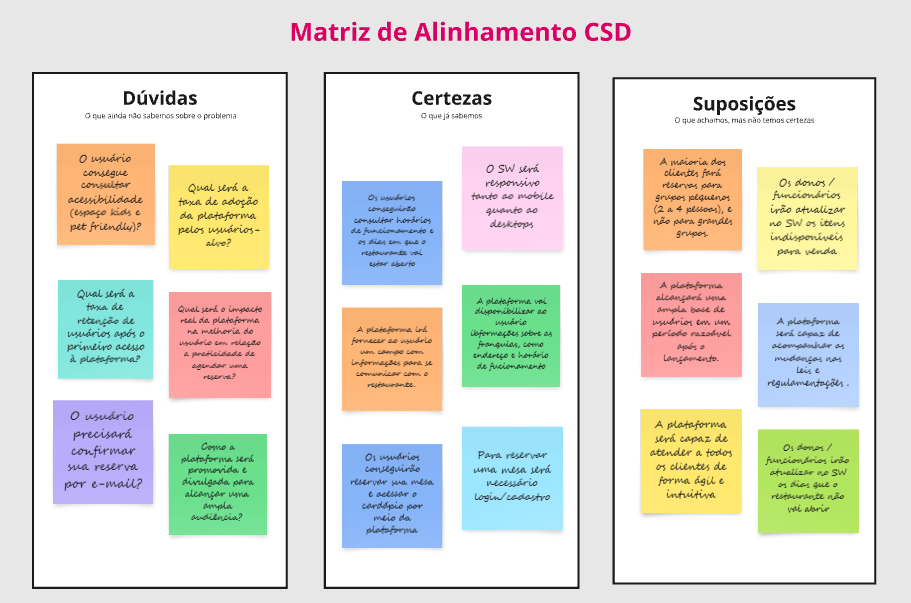]

> * **Mapa de stakeholders**: ferramenta que nos permite compreender o grupo de pessoas e entidades que devemos estudar e conversar para entender mais sobre o problema

[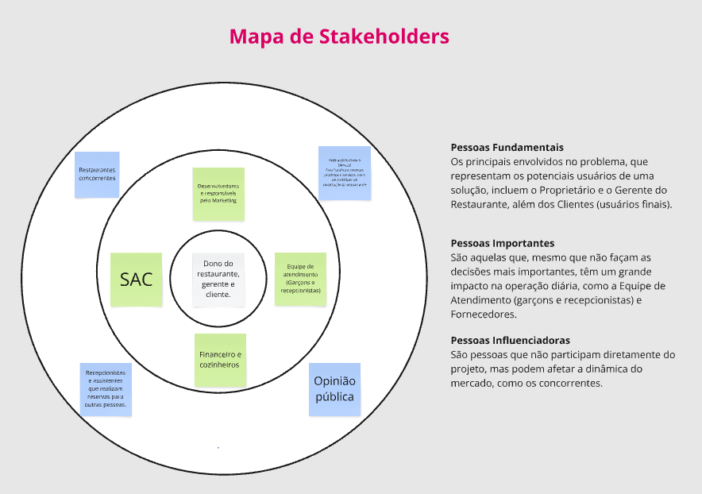]

> * **Entrevistas qualitativas**: série de entrevistas qualitativas para validar suposições e solucionar as dúvidas com as principais pessoas envolvidas;

[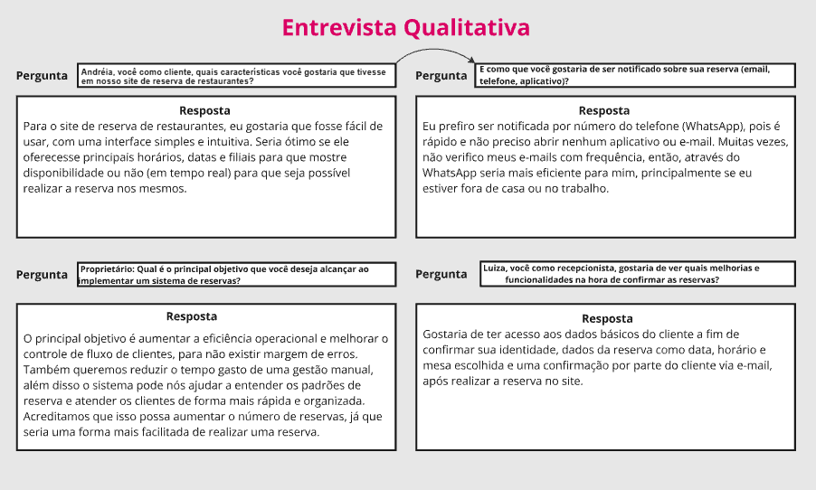]

> * **Highlights de pesquisa**: um compilado do levantamento realizado por meio das entrevistas.

[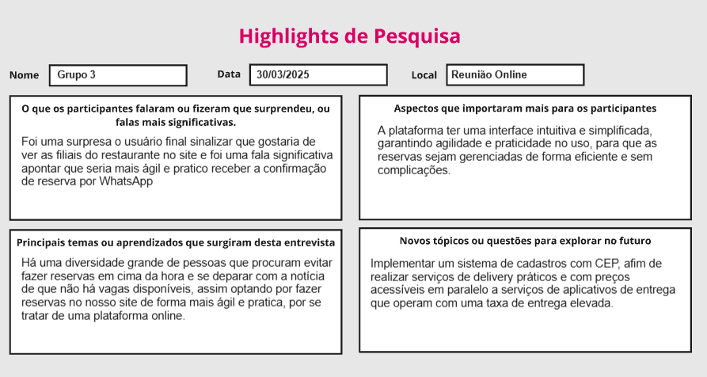]

## Etapa de Definição

### Personas

**✳️✳️✳️ APRESENTE OS DIAGRAMAS DE PERSONAS ✳️✳️✳️**

> * **Persona 1**: José Carlos
> 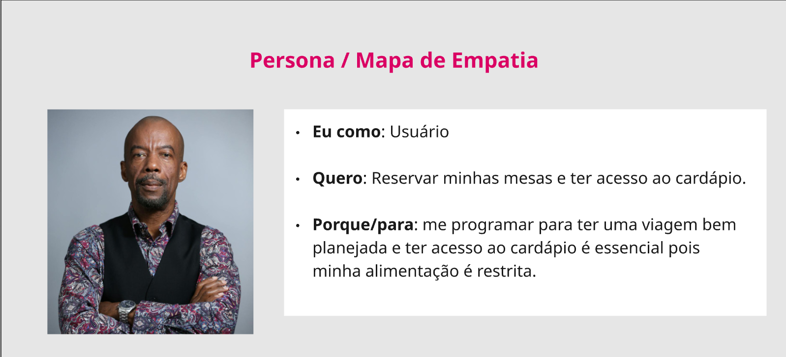
> 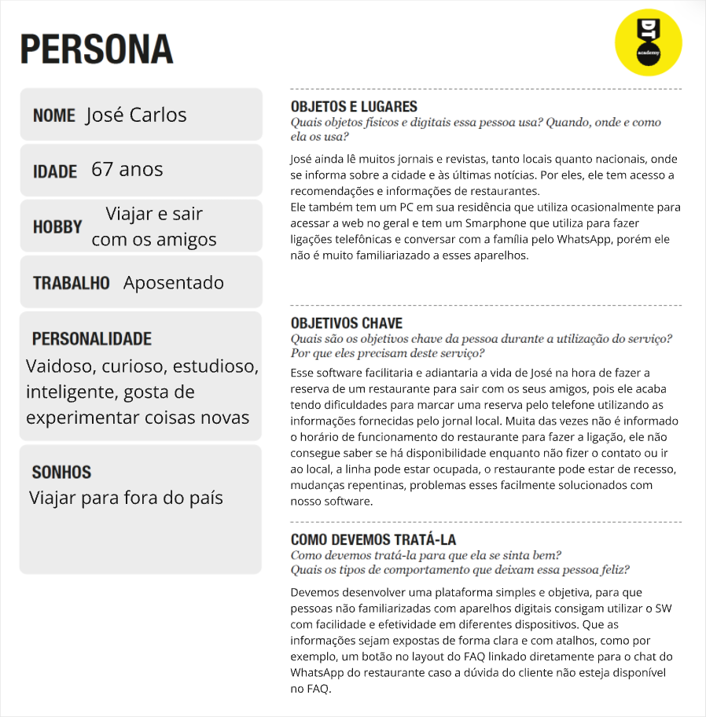

> * **Persona 2**: Duda
> 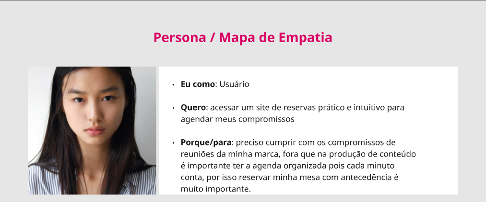
> 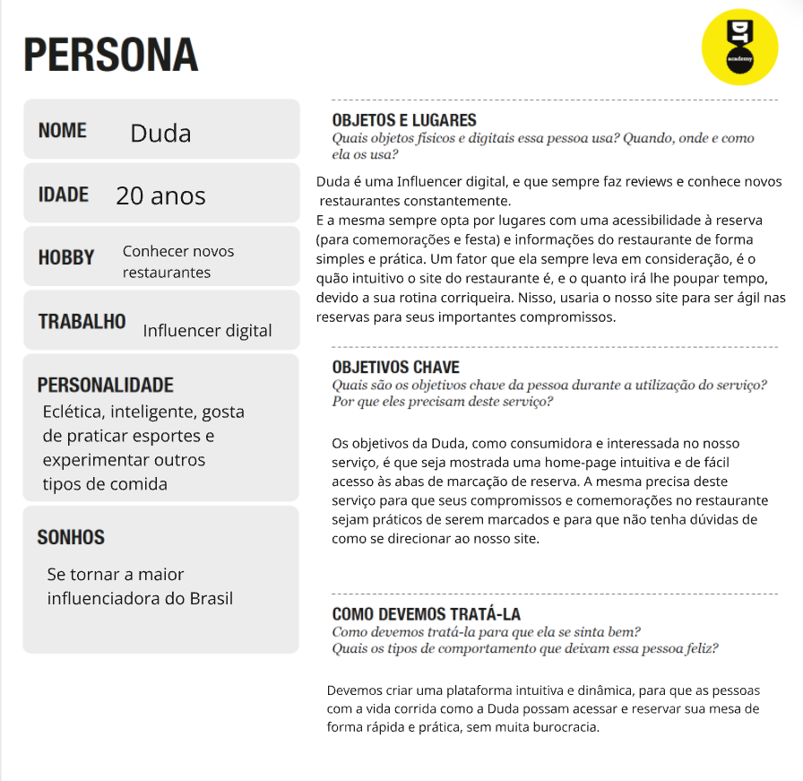

> * **Persona 3**: Beatriz
> 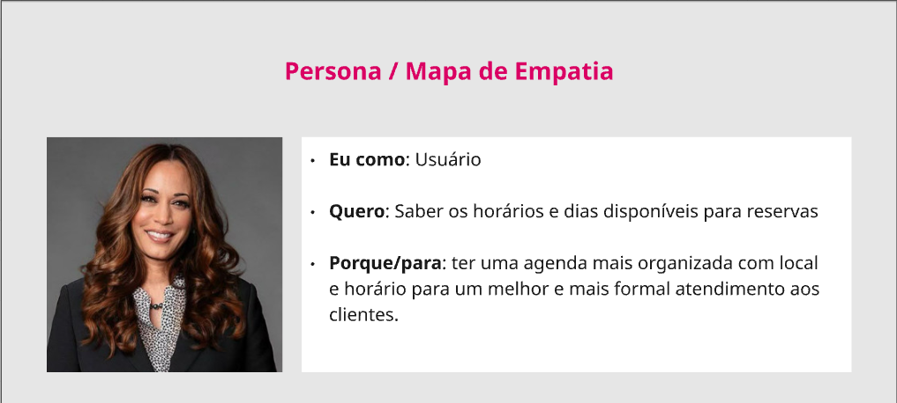
> 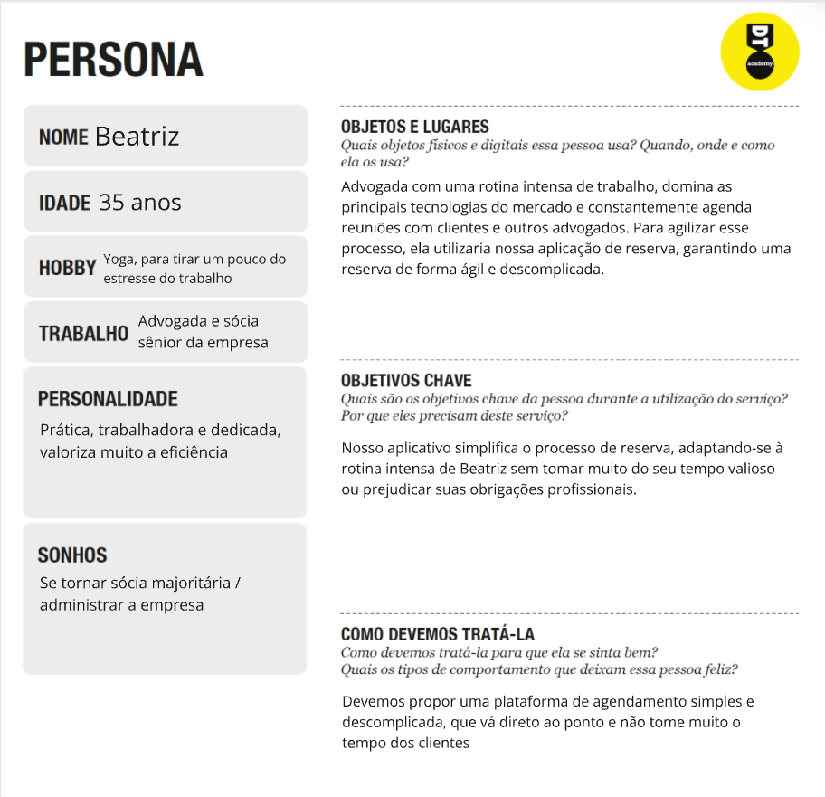


# Product Design

Nesse momento, vamos transformar os insights e validações obtidos em soluções tangíveis e utilizáveis. Essa fase envolve a definição de uma proposta de valor, detalhando a prioridade de cada ideia e a consequente criação de wireframes, mockups e protótipos de alta fidelidade, que detalham a interface e a experiência do usuário.

## Histórias de Usuários

Com base na análise das personas foram identificadas as seguintes histórias de usuários:

| EU COMO...`PERSONA` | QUERO/PRECISO ...`FUNCIONALIDADE`                  | PARA ...`MOTIVO/VALOR`               |
| --------------------- | -----------------------------------------------  | -------------------------------------- |
| Usuário do sistema   | Saber os horários e dias disponíveis para reservas | ter uma agenda mais organizada com local e horário para um melhor e mais formal atendimento aos clientes.                                                                               |
| Usuário do sistema          | acessar um site de reservas prático e intuitivo para agendar meus compromissos      | preciso cumprir com os compromissos de reuniões da minha marca, fora que na produção de conteúdo é importante ter a agenda organizada pois cada minuto conta, por isso reservar minha mesa com antecedência é muito importante. |
| Usuário do sistema          | Reservar minhas mesas e ter acesso ao cardápio   | me programar para ter uma viagem bem planejada e ter acesso ao cardápio é essencial pois minha alimentação é restrita. |
>

## Proposta de Valor

**✳️✳️✳️ APRESENTE O DIAGRAMA DA PROPOSTA DE VALOR PARA CADA PERSONA ✳️✳️✳️**

##### Proposta para Persona XPTO ⚠️ EXEMPLO ⚠️


> ⚠️ **APAGUE ESSA PARTE ANTES DE ENTREGAR SEU TRABALHO**
>
> O mapa da proposta de valor é uma ferramenta que nos ajuda a definir qual tipo de produto ou serviço melhor atende às personas definidas anteriormente.

## Requisitos

As tabelas que se seguem apresentam os requisitos funcionais e não funcionais que detalham o escopo do projeto.

### Requisitos Funcionais

| ID     | Descrição do Requisito                                   | Prioridade |
| ------ | ---------------------------------------------------------- | ---------- |
| RF-001 | Permitir que o usuário cadastre tarefas ⚠️ EXEMPLO ⚠️ | ALTA       |
| RF-002 | Emitir um relatório de tarefas no mês ⚠️ EXEMPLO ⚠️ | MÉDIA     |

### Requisitos não Funcionais

| ID      | Descrição do Requisito                                                              | Prioridade |
| ------- | ------------------------------------------------------------------------------------- | ---------- |
| RNF-001 | O sistema deve ser responsivo para rodar em um dispositivos móvel ⚠️ EXEMPLO ⚠️ | MÉDIA     |
| RNF-002 | Deve processar requisições do usuário em no máximo 3s ⚠️ EXEMPLO ⚠️          | BAIXA      |

>

## Projeto de Interface

Artefatos relacionados com a interface e a interacão do usuário na proposta de solução.

### Wireframes

# Wireframe da tela principal

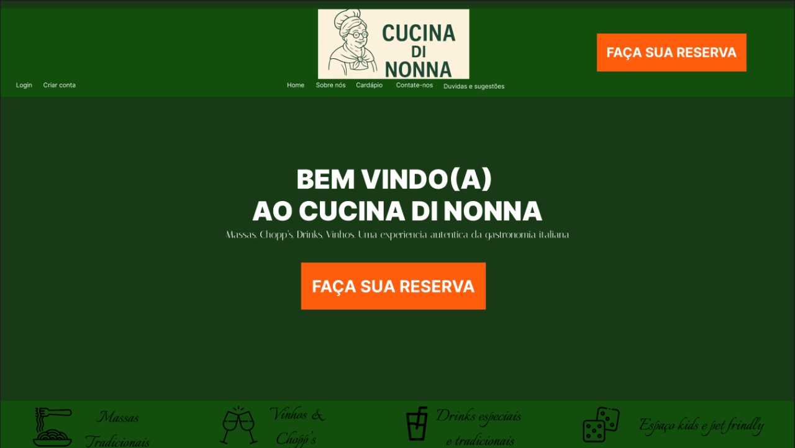

# Wireframe da tela sobre nós

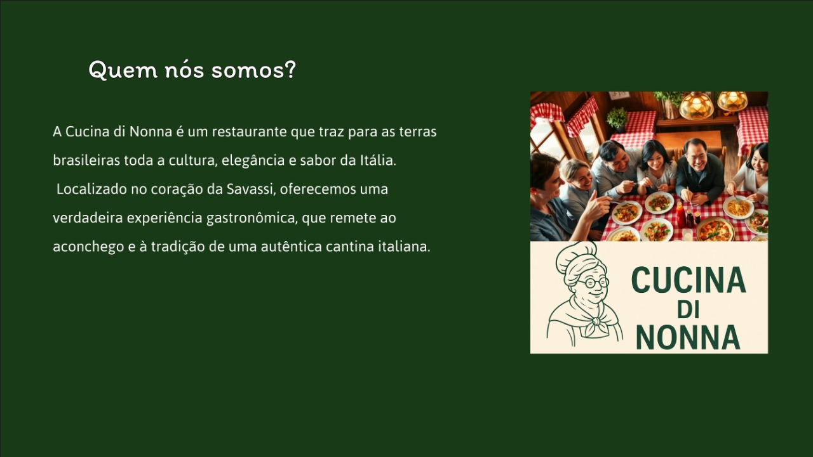

# Wireframe da tela cardápio

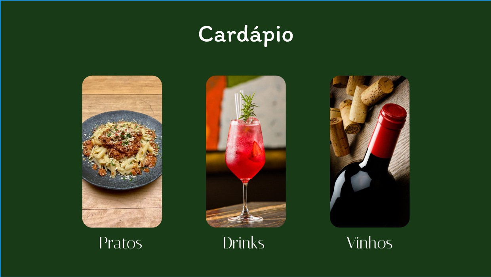

# Wireframe da tela sac

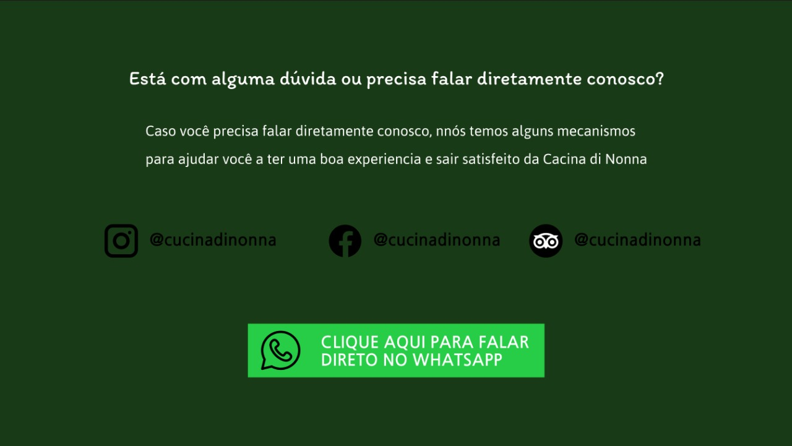

# Wireframe da tela dúvidas

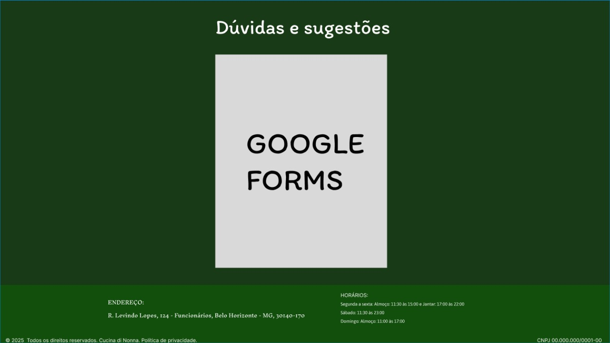

### User Flow

**✳️✳️✳️ COLOQUE AQUI O DIAGRAMA DE FLUXO DE TELAS ✳️✳️✳️**


> ⚠️ **APAGUE ESSA PARTE ANTES DE ENTREGAR SEU TRABALHO**
>
> Fluxo de usuário (User Flow) é uma técnica que permite ao desenvolvedor mapear todo fluxo de telas do site ou app. Essa técnica funciona para alinhar os caminhos e as possíveis ações que o usuário pode fazer junto com os membros de sua equipe.
>
> **Orientações**:
>
> - [User Flow: O Quê É e Como Fazer?](https://medium.com/7bits/fluxo-de-usu%C3%A1rio-user-flow-o-que-%C3%A9-como-fazer-79d965872534)
> - [User Flow vs Site Maps](http://designr.com.br/sitemap-e-user-flow-quais-as-diferencas-e-quando-usar-cada-um/)
> - [Top 25 User Flow Tools &amp; Templates for Smooth](https://www.mockplus.com/blog/post/user-flow-tools)

### Protótipo Interativo

**✳️✳️✳️ COLOQUE AQUI UM IFRAME COM SEU PROTÓTIPO INTERATIVO ✳️✳️✳️**

✅ [Protótipo Interativo (MarvelApp)](https://marvelapp.com/prototype/4hd6091?emb=1&iosapp=false&frameless=false)  ⚠️ EXEMPLO ⚠️

> ⚠️ **APAGUE ESSA PARTE ANTES DE ENTREGAR SEU TRABALHO**
>
> Um protótipo interativo apresenta o projeto de interfaces e permite ao usuário navegar pelas funcionalidades como se estivesse lidando com o software pronto. Utilize as mesmas ferramentas de construção de wireframes para montagem do seu protótipo interativo. Inclua o link para o protótipo interativo do projeto.

# Metodologia

Detalhes sobre a organização do grupo e o ferramental empregado.

## Ferramentas

Relação de ferramentas empregadas pelo grupo durante o projeto.

| Ambiente                    | Plataforma | Link de acesso                                     |
| --------------------------- | ---------- | -------------------------------------------------- |
| Processo de Design Thinking | Miro       | https://miro.com/app/board/uXjVISOwuoM=/       |
| Repositório de código     | GitHub     | https://github.com/ICEI-PUC-Minas-PPLCC-TI/ti-1-ppl-cc-m-20232-dona-cocina-restaurante/tree/master      |
| Protótipo Interativo       | Figma  | https://marvelapp.com/XXXXXXX ⚠️ EXEMPLO ⚠️   |
|                             |            |                                                    |

> ⚠️ **APAGUE ESSA PARTE ANTES DE ENTREGAR SEU TRABALHO**
>
> Liste as ferramentas empregadas no desenvolvimento do projeto, justificando a escolha delas, sempre que possível. Inclua itens como: (1) Editor de código, (2) )ferramentas de comunicação, (3) )ferramentas de diagramação, (4) )plataformas de hospedagem, entre outras.

## Gerenciamento do Projeto

Divisão de papéis no grupo e apresentação da estrutura da ferramenta de controle de tarefas (Kanban).

| ID      | Backlog/Requisitos                                        | Membro |
|-------- | --------------------------------------------------------- |------- |
| 1 | Histórias de Usuários | Davi Santana Pinheiro Andrade |
| 2 | Histórias de Usuários | Maria Eduarda Botelho |
| 3 | Mapa Proposta de Valor | João Vitor Miranda |
| 4 | Mapa Proposta de Valor | Octávio Vieira de Oliveira |
| 5 | Requisitos do Software | Breno de Oliveira Hassel |
| 6 | Requisitos do Software | Hamilton Henrique Gomes |
| 7 | Documentação do projeto: Introdução | Breno de Oliveira Hassel |
| 8 | Documentação do projeto: Problema | Octávio Vieira de Oliveira |
| 9 | Documentação do projeto: Objetivo do projeto | Davi Santana Pinheiro Andrade |
| 10 | Documentação do projeto: Justificativa | Hamilton Henrique Gomes |
| 11 | Documentação do projeto: Público-alvo | Maria Eduarda Botelho |
| 12 | Especificação do Projeto: História de usuário | Davi Santana Pinheiro Andrade |
| 13 | Especificação do Projeto: História de usuário | Maria Eduarda Botelho |
| 14 | Projeto de Interfaces: (Fluxo do usuário, Wireframes das telas, Protótipo Interativo [LINK]) | João Vitor Miranda |
| 15 | Metodologia | Maria Eduarda Botelho |


# Solução Implementada

Esta seção apresenta todos os detalhes da solução criada no projeto.

## Vídeo do Projeto

O vídeo a seguir traz uma apresentação do problema que a equipe está tratando e a proposta de solução. ⚠️ EXEMPLO ⚠️

[](https://www.youtube.com/embed/70gGoFyGeqQ)

> ⚠️ **APAGUE ESSA PARTE ANTES DE ENTREGAR SEU TRABALHO**
>
> O video de apresentação é voltado para que o público externo possa conhecer a solução. O formato é livre, sendo importante que seja apresentado o problema e a solução numa linguagem descomplicada e direta.
>
> Inclua um link para o vídeo do projeto.

## Funcionalidades

Esta seção apresenta as funcionalidades da solução.Info

##### Funcionalidade 1 - Cadastro de Contatos ⚠️ EXEMPLO ⚠️

Permite a inclusão, leitura, alteração e exclusão de contatos para o sistema

* **Estrutura de dados:** [Contatos](#ti_ed_contatos)
* **Instruções de acesso:**
  * Abra o site e efetue o login
  * Acesse o menu principal e escolha a opção Cadastros
  * Em seguida, escolha a opção Contatos
* **Tela da funcionalidade**:


> ⚠️ **APAGUE ESSA PARTE ANTES DE ENTREGAR SEU TRABALHO**
>
> Apresente cada uma das funcionalidades que a aplicação fornece tanto para os usuários quanto aos administradores da solução.
>
> Inclua, para cada funcionalidade, itens como: (1) titulos e descrição da funcionalidade; (2) Estrutura de dados associada; (3) o detalhe sobre as instruções de acesso e uso.

## Estruturas de Dados

Descrição das estruturas de dados utilizadas na solução com exemplos no formato JSON.Info

##### Estrutura de Dados - Contatos   ⚠️ EXEMPLO ⚠️

Contatos da aplicação

```json
  {
    "id": 1,
    "nome": "Leanne Graham",
    "cidade": "Belo Horizonte",
    "categoria": "amigos",
    "email": "Sincere@april.biz",
    "telefone": "1-770-736-8031",
    "website": "hildegard.org"
  }
  
```

##### Estrutura de Dados - Usuários  ⚠️ EXEMPLO ⚠️

Registro dos usuários do sistema utilizados para login e para o perfil do sistema

```json
  {
    id: "eed55b91-45be-4f2c-81bc-7686135503f9",
    email: "admin@abc.com",
    id: "eed55b91-45be-4f2c-81bc-7686135503f9",
    login: "admin",
    nome: "Administrador do Sistema",
    senha: "123"
  }
```

> ⚠️ **APAGUE ESSA PARTE ANTES DE ENTREGAR SEU TRABALHO**
>
> Apresente as estruturas de dados utilizadas na solução tanto para dados utilizados na essência da aplicação quanto outras estruturas que foram criadas para algum tipo de configuração
>
> Nomeie a estrutura, coloque uma descrição sucinta e apresente um exemplo em formato JSON.
>
> **Orientações:**
>
> * [JSON Introduction](https://www.w3schools.com/js/js_json_intro.asp)
> * [Trabalhando com JSON - Aprendendo desenvolvimento web | MDN](https://developer.mozilla.org/pt-BR/docs/Learn/JavaScript/Objects/JSON)

## Módulos e APIs

Esta seção apresenta os módulos e APIs utilizados na solução

**Images**:

* Unsplash - [https://unsplash.com/](https://unsplash.com/) ⚠️ EXEMPLO ⚠️

**Fonts:**

* Icons Font Face - [https://fontawesome.com/](https://fontawesome.com/) ⚠️ EXEMPLO ⚠️

**Scripts:**

* jQuery - [http://www.jquery.com/](http://www.jquery.com/) ⚠️ EXEMPLO ⚠️
* Bootstrap 4 - [http://getbootstrap.com/](http://getbootstrap.com/) ⚠️ EXEMPLO ⚠️

> ⚠️ **APAGUE ESSA PARTE ANTES DE ENTREGAR SEU TRABALHO**
>
> Apresente os módulos e APIs utilizados no desenvolvimento da solução. Inclua itens como: (1) Frameworks, bibliotecas, módulos, etc. utilizados no desenvolvimento da solução; (2) APIs utilizadas para acesso a dados, serviços, etc.

# Referências

As referências utilizadas no trabalho foram:

* SOBRENOME, Nome do autor. Título da obra. 8. ed. Cidade: Editora, 2000. 287 p ⚠️ EXEMPLO ⚠️

> ⚠️ **APAGUE ESSA PARTE ANTES DE ENTREGAR SEU TRABALHO**
>
> Inclua todas as referências (livros, artigos, sites, etc) utilizados no desenvolvimento do trabalho.
>
> **Orientações**:
>
> - [Formato ABNT](https://www.normastecnicas.com/abnt/trabalhos-academicos/referencias/)
> - [Referências Bibliográficas da ABNT](https://comunidade.rockcontent.com/referencia-bibliografica-abnt/)
